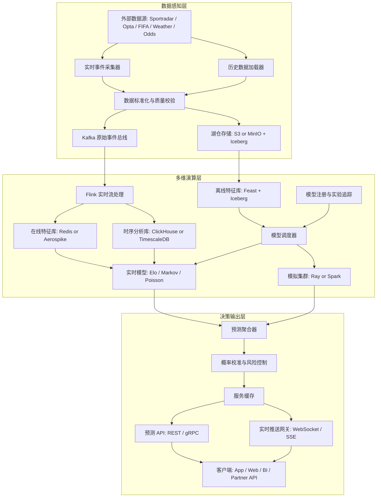
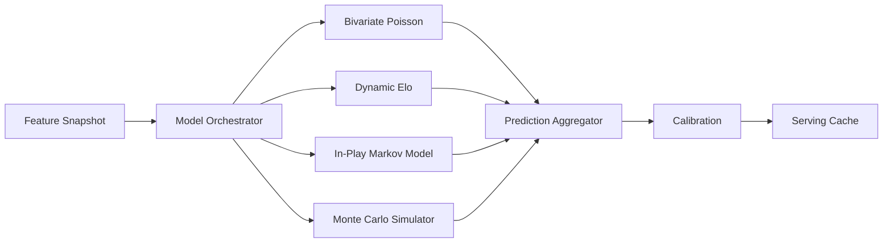

# 2026美加墨世界杯智能预测引擎架构功能设计文档

## 1. 文档目标

本文档定义“2026美加墨世界杯智能预测引擎”的基础架构、功能边界、核心数据链路、模型计算链路、服务输出链路与容灾降级策略。

系统目标：

- 支持 48 支球队、多赛区、多时区、多气候带的世界杯预测场景。
- 支持赛前、赛中、赛后多阶段概率建模。
- 支持比赛进行中的高频事件接入、毫秒级特征更新和低延迟预测推送。
- 支持多模型并行运行，包括双变量泊松回归、动态 Elo、马尔可夫链赛中状态模型、蒙特卡洛全局模拟。
- 支持外部数据供应商延迟、错误或宕机时的平滑降级。

## 2. 第一性原理设计

预测引擎的本质是一个“状态估计系统”：

1. 外部世界产生比赛事件、阵容变化、天气变化、赔率变化和赛程结果。
2. 系统把这些变化转化为可信的、可回放的标准事件流。
3. 实时特征层把事件流转化为比赛状态。
4. 多个模型从不同假设出发估计未来状态分布。
5. 决策输出层融合模型结果，生成可解释、可审计、可推送的概率结果。

因此系统必须围绕四类核心流建设：

- 数据流：从外部数据源进入系统。
- 状态流：从事件转化为比赛状态和特征状态。
- 模型流：从特征快照转化为概率分布。
- 结果流：从模型输出转化为业务 API 和客户端推送。

## 3. 总体架构拓扑

## 4. 分层功能设计

### 4.1 数据感知层

职责：

- 接入外部实时数据、历史数据、天气数据、赔率数据、球队和球员基础数据。
- 统一供应商数据格式，形成标准事件模型。
- 执行 schema 校验、字段完整性校验、时间戳校验、来源可信度打分。
- 将原始数据写入湖仓，保证可回放。
- 将标准化事件写入 Kafka，供实时计算消费。

关键组件：

- Real-Time Event Collector：接收比赛实时事件。
- Batch Historical Loader：加载历史比赛、球员、球队、赛程数据。
- Data Normalizer：将不同供应商字段映射为统一事件模型。
- Data Quality Service：检测迟到事件、重复事件、冲突事件和异常值。
- Raw Event Bus：承载标准化后的实时事件流。
- Data Lake：保存原始事件、标准事件、训练数据和预测快照。

标准事件原则：

- 每个事件必须有全局唯一事件 ID。
- 每个事件必须包含来源、供应商时间、系统接入时间、比赛 ID、事件类型和置信度。
- 不直接覆盖历史事件，修正事件以 correction 方式追加。
- 原始数据和标准数据都必须可回放。

### 4.2 多维演算层

职责：

- 将事件流转化为实时比赛状态和在线特征。
- 将历史数据转化为离线训练特征。
- 运行赛前模型、赛中模型和全局模拟模型。
- 管理模型版本、特征版本、训练数据版本和预测输出版本。

关键组件：

- Flink Stream Processor：负责事件时间处理、窗口聚合、状态更新。
- Online Feature Store：保存低延迟读取的实时特征。
- Offline Feature Store：保存训练和批量推理特征。
- Model Orchestrator：根据赛程、事件、时间和优先级调度模型。
- Real-Time Model Serving：承载轻量级低延迟模型。
- Simulation Cluster：承载大规模蒙特卡洛模拟。
- Model Registry：记录模型版本、评估指标、上线状态和回滚点。

核心模型：

- 双变量泊松回归：建模双方进球分布，适合赛前比分概率估计。
- 动态 Elo：建模球队强度随时间变化，适合实力先验和赛后更新。
- 马尔可夫链赛中模型：根据比分、时间、红牌、换人、xG、场面压力估计剩余比赛状态转移。
- 蒙特卡洛模拟：模拟小组赛、淘汰赛路径、冠军概率和情景敏感性。
- 校准模型：对不同模型输出做概率校准，降低过度自信。

### 4.3 决策输出层

职责：

- 汇聚多个模型的预测输出。
- 执行模型融合、概率校准、置信度控制和异常抑制。
- 对外提供查询 API、订阅 API 和实时推送。
- 在高并发场景下通过缓存和推送节流保护系统。

关键组件：

- Prediction Aggregator：融合不同模型输出。
- Calibration Service：执行 Platt scaling、isotonic regression 或分桶校准。
- Risk Control Service：识别异常概率跳变、供应商数据冲突和模型漂移。
- Serving Cache：缓存最新预测结果和热点比赛预测。
- Prediction API：提供客户端和合作方查询能力。
- Push Gateway：通过 WebSocket 或 SSE 推送实时预测。

## 5. 核心数据域

### 5.1 比赛域

- match_id
- competition_id
- group_id
- stage
- home_team_id
- away_team_id
- venue_id
- kickoff_time_utc
- status
- score
- match_clock

### 5.2 球队域

- team_id
- team_name
- confederation
- fifa_rank
- elo_rating
- squad_strength
- recent_form
- travel_load
- climate_adaptation_score

### 5.3 球员域

- player_id
- team_id
- position
- club_level
- minutes_load
- injury_status
- expected_starting
- substitution_probability

### 5.4 事件域

- event_id
- match_id
- event_type
- event_time
- ingest_time
- team_id
- player_id
- x
- y
- payload
- source
- confidence_score
- correction_flag

### 5.5 预测域

- prediction_id
- match_id
- model_name
- model_version
- feature_version
- prediction_time
- win_probability
- draw_probability
- loss_probability
- scoreline_distribution
- advance_probability
- champion_probability
- confidence_level

## 6. 技术栈选型

| 模块 | 推荐技术 | 选型理由 |
|---|---|---|
| 消息队列 | Apache Kafka + Schema Registry | 高吞吐、支持分区顺序、支持事件重放、生态成熟 |
| 流处理 | Apache Flink | 支持事件时间、watermark、exactly-once、状态计算和迟到事件处理 |
| 湖仓 | S3 or MinIO + Apache Iceberg | 支持版本管理、schema evolution、增量读取和训练数据回溯 |
| 时序分析库 | ClickHouse | 写入吞吐高，适合模型输出曲线、事件轨迹和聚合分析 |
| 关系型数据库 | PostgreSQL | 适合赛程、球队、球员、模型元数据、权限和配置 |
| 在线特征库 | Redis Cluster or Aerospike | 支持毫秒级读写，适合实时推理 |
| 离线特征库 | Feast + Iceberg | 保证训练和线上推理特征口径一致 |
| 模型服务 | KServe / BentoML / Triton | 支持模型版本化、弹性部署、灰度和回滚 |
| 批量计算 | Ray / Spark | 支持大规模并行模拟和批量特征生成 |
| 调度系统 | Argo Workflows / Airflow | Argo 适合 K8s 原生任务，Airflow 适合数据工作流编排 |
| API 网关 | Envoy / Kong | 统一鉴权、限流、熔断和路由 |
| 监控追踪 | Prometheus + Grafana + OpenTelemetry | 覆盖指标、日志、链路追踪和告警 |

## 7. 模型计算架构

模型解耦规则：

- 模型只依赖标准特征快照，不直接读取外部供应商接口。
- 模型输出必须是标准概率分布，不输出业务文案。
- 模型服务必须携带 model_version、feature_version 和 data_snapshot_version。
- 聚合层负责融合，不把融合逻辑散落到各模型服务。
- 实时模型和离线模拟模型使用不同计算资源池，避免互相抢占。

## 8. 冷门盲区处理

2026 年扩军至 48 支球队后，部分球队历史交锋数据稀疏。系统需要使用层级先验和迁移特征补足数据缺口。

可用先验：

- 洲际足联强度。
- 预选赛对手强度校正后的表现。
- 球员所属俱乐部联赛强度。
- 球队年龄结构和国际比赛经验。
- 近期友谊赛和正式比赛状态。
- 市场身价和阵容完整度。
- 旅行距离、时差和气候适应。

处理策略：

- 不对小样本球队直接使用高方差历史交锋模型。
- 使用层级贝叶斯或 shrinkage 方法向区域均值收缩。
- 给冷门盲区输出更宽的置信区间。
- 在 Prediction Aggregator 中降低小样本模型权重。

## 9. 高可用与降级设计

### 9.1 数据供应商故障等级

| 等级 | 场景 | 降级策略 |
|---|---|---|
| Level 0 | 单条事件延迟 | watermark 容忍迟到事件，局部窗口重算 |
| Level 1 | 主供应商延迟数秒 | 切换备用供应商，降低事件可信度权重 |
| Level 2 | 主供应商短时不可用 | 使用备用源和最近可信状态，降低更新频率 |
| Level 3 | 多供应商不可用 | 冻结 In-Play 模型，回退到赛前模型加当前比分状态 |
| Level 4 | 数据长时间中断 | 停止高频预测，只展示最后可信快照和置信度下降标记 |

### 9.2 模型降级顺序

1. 完整实时模型：Markov + Poisson + Elo + live features。
2. 轻量实时模型：score + time + card state。
3. 赛前增强模型：pre-match prior + current score。
4. 静态快照：last known prediction snapshot。

### 9.3 推送降级

- 正常状态：按事件推送。
- 高峰状态：按比赛维度合并推送。
- 压力状态：每 5 秒或 15 秒节流推送。
- 异常状态：仅推送重大事件后的预测更新。

## 10. 观测指标

数据指标：

- feed_latency_ms
- event_ingest_qps
- event_validation_error_rate
- duplicate_event_rate
- correction_event_rate

计算指标：

- flink_checkpoint_duration_ms
- flink_backpressure_ratio
- feature_update_latency_ms
- model_inference_latency_ms
- simulation_job_duration_sec

服务指标：

- api_p95_latency_ms
- api_p99_latency_ms
- websocket_active_connections
- push_delivery_latency_ms
- cache_hit_ratio

模型指标：

- brier_score
- log_loss
- calibration_error
- prediction_drift
- model_output_jump_rate

## 11. 安全与合规

- 外部供应商 API key 使用密钥管理系统托管。
- 内部服务采用 mTLS 或服务网格认证。
- 合作方 API 使用 OAuth2 或签名鉴权。
- 所有预测输出保留审计记录。
- 用户访问和合作方访问分级限流。
- 原始供应商数据按授权范围使用，避免越权分发。

## 12. 架构结论

该架构采用“数据事件化、特征状态化、模型服务化、输出版本化”的设计原则。

实时链路负责低延迟状态更新，离线链路负责深度模拟和模型训练，输出链路负责稳定服务与平滑降级。通过 Kafka、Flink、Feature Store、Model Orchestrator、Prediction Aggregator 的分层解耦，可以在世界杯高并发、高不确定性和多模型并行场景下保持系统可扩展、可回放、可审计和可持续演进。
