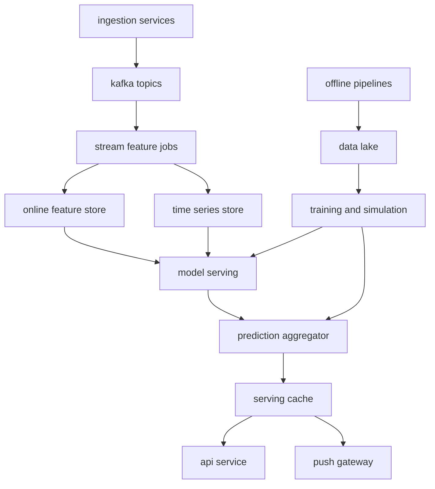
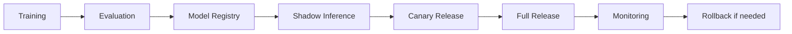

# 2026美加墨世界杯智能预测引擎技术实现文档

## 1. 文档目标

本文档面向工程落地，定义系统模块拆分、服务职责、数据主题、存储表、接口契约、模型调度方式、部署方式、里程碑和验收标准。

目标是将架构设计转化为可实施的工程蓝图。

## 2. 推荐工程分层

建议采用多服务架构，按数据、特征、模型、输出、运维五个域拆分。



## 3. 服务清单

### 3.1 ingestion-realtime

职责：

- 接入 Sportradar、Opta、天气、赔率等实时接口。
- 执行供应商鉴权、重试、限流和数据接收。
- 将原始响应写入 raw storage。
- 将初步事件写入 normalizer。

关键要求：

- 支持多供应商并行接入。
- 每个供应商独立限流和熔断。
- 接入时间必须记录为 ingest_time。
- 不在该服务中写模型逻辑。

### 3.2 ingestion-batch

职责：

- 导入历史比赛、球员、球队、赛程、预选赛、友谊赛和场馆数据。
- 生成离线训练数据的基础事实表。
- 支持重复导入和幂等更新。

### 3.3 event-normalizer

职责：

- 将不同供应商事件映射为统一事件模型。
- 处理字段映射、枚举映射、坐标归一化、时钟归一化。
- 为事件生成 event_id。
- 输出到 Kafka 标准 topic。

### 3.4 data-quality-service

职责：

- 检测重复事件、迟到事件、冲突事件、缺失字段、异常值。
- 计算 confidence_score。
- 生成 data_quality_alert。

### 3.5 feature-stream-job

职责：

- 消费 Kafka 标准事件。
- 使用 Flink 维护每场比赛状态。
- 生成实时特征并写入在线特征库。
- 将事件轨迹和特征曲线写入 ClickHouse。

### 3.6 feature-offline-pipeline

职责：

- 从湖仓读取历史数据。
- 生成训练特征、校准特征和模拟输入快照。
- 写入 Feast offline store 和 Iceberg 表。

### 3.7 model-orchestrator

职责：

- 根据赛程、事件、模型优先级和资源状态调度模型。
- 管理赛前、赛中、赛后、全局模拟四类任务。
- 记录每次推理或模拟的输入版本和输出版本。

### 3.8 model-serving

职责：

- 承载低延迟模型推理。
- 提供 gRPC 或 REST 推理接口。
- 支持模型灰度、回滚和 A/B 测试。

### 3.9 simulation-service

职责：

- 使用 Ray 或 Spark 执行蒙特卡洛模拟。
- 支持全盘模拟和局部增量模拟。
- 输出小组出线、晋级路径、冠军概率。

### 3.10 prediction-aggregator

职责：

- 融合不同模型输出。
- 执行概率归一化、校准和置信度调整。
- 识别异常跳变。
- 写入 serving cache 和 prediction output topic。

### 3.11 prediction-api

职责：

- 为客户端、BI 和合作方提供预测查询。
- 支持按比赛、球队、阶段、模型版本查询。
- 执行鉴权、限流、缓存和审计。

### 3.12 push-gateway

职责：

- 管理 WebSocket 和 SSE 连接。
- 按 match_id、team_id、competition_id 订阅推送。
- 支持节流、合并、断线重连和版本去重。

## 4. Kafka Topic 设计

```text
raw.vendor.events
normalized.match.events
normalized.player.events
normalized.weather.events
normalized.odds.events
data.quality.alerts
features.match.realtime
features.team.realtime
models.inference.requests
models.inference.outputs
simulation.requests
simulation.outputs
predictions.live
predictions.snapshot
system.audit.events
```

分区建议：

- 实时比赛事件按 match_id 分区。
- 球员事件可按 match_id 或 team_id 分区。
- 模型输出按 match_id 分区。
- 全局模拟输出按 simulation_run_id 分区。

## 5. 数据模型设计

### 5.1 PostgreSQL 元数据表

```sql
CREATE TABLE teams (
    team_id VARCHAR(64) PRIMARY KEY,
    team_name VARCHAR(128) NOT NULL,
    confederation VARCHAR(32),
    fifa_rank INTEGER,
    created_at TIMESTAMP NOT NULL,
    updated_at TIMESTAMP NOT NULL
);

CREATE TABLE matches (
    match_id VARCHAR(64) PRIMARY KEY,
    competition_id VARCHAR(64) NOT NULL,
    stage VARCHAR(64) NOT NULL,
    home_team_id VARCHAR(64) NOT NULL,
    away_team_id VARCHAR(64) NOT NULL,
    venue_id VARCHAR(64),
    kickoff_time_utc TIMESTAMP NOT NULL,
    status VARCHAR(32) NOT NULL,
    created_at TIMESTAMP NOT NULL,
    updated_at TIMESTAMP NOT NULL
);

CREATE TABLE model_versions (
    model_version_id VARCHAR(128) PRIMARY KEY,
    model_name VARCHAR(128) NOT NULL,
    version VARCHAR(64) NOT NULL,
    artifact_uri VARCHAR(512) NOT NULL,
    status VARCHAR(32) NOT NULL,
    metrics_json JSONB,
    created_at TIMESTAMP NOT NULL
);

CREATE TABLE prediction_versions (
    prediction_version_id VARCHAR(128) PRIMARY KEY,
    match_id VARCHAR(64) NOT NULL,
    model_version_id VARCHAR(128),
    feature_version VARCHAR(128) NOT NULL,
    generated_at TIMESTAMP NOT NULL,
    status VARCHAR(32) NOT NULL
);
```

### 5.2 ClickHouse 时序表

```sql
CREATE TABLE match_event_ts
(
    event_time DateTime64(3),
    ingest_time DateTime64(3),
    match_id String,
    event_id String,
    event_type String,
    team_id String,
    player_id String,
    x Float32,
    y Float32,
    source String,
    confidence_score Float32
)
ENGINE = MergeTree
PARTITION BY toDate(event_time)
ORDER BY (match_id, event_time, event_id);

CREATE TABLE prediction_ts
(
    prediction_time DateTime64(3),
    match_id String,
    prediction_version_id String,
    model_name String,
    model_version String,
    home_win_prob Float32,
    draw_prob Float32,
    away_win_prob Float32,
    confidence_level Float32
)
ENGINE = MergeTree
PARTITION BY toDate(prediction_time)
ORDER BY (match_id, prediction_time, prediction_version_id);
```

## 6. 标准事件结构

```json
{
  "event_id": "evt_001",
  "match_id": "match_001",
  "event_type": "shot",
  "event_time": "2026-06-12T20:15:30.123Z",
  "ingest_time": "2026-06-12T20:15:30.310Z",
  "team_id": "team_a",
  "player_id": "player_001",
  "period": 1,
  "match_clock_sec": 930,
  "x": 88.2,
  "y": 41.5,
  "source": "sportradar",
  "confidence_score": 0.98,
  "correction_flag": false,
  "payload": {}
}
```

## 7. 标准预测输出结构

```json
{
  "prediction_id": "pred_001",
  "prediction_version_id": "pv_001",
  "match_id": "match_001",
  "generated_at": "2026-06-12T20:15:30.500Z",
  "feature_version": "fv_001",
  "models": [
    {
      "model_name": "dynamic_elo",
      "model_version": "1.0.0",
      "weight": 0.25
    },
    {
      "model_name": "in_play_markov",
      "model_version": "1.0.0",
      "weight": 0.45
    },
    {
      "model_name": "bivariate_poisson",
      "model_version": "1.0.0",
      "weight": 0.30
    }
  ],
  "probabilities": {
    "home_win": 0.42,
    "draw": 0.31,
    "away_win": 0.27
  },
  "confidence_level": 0.86,
  "degradation_level": 0
}
```

## 8. API 设计

### 8.1 查询单场比赛预测

```text
GET /api/v1/matches/{match_id}/prediction
```

响应：

```json
{
  "match_id": "match_001",
  "prediction_version_id": "pv_001",
  "generated_at": "2026-06-12T20:15:30.500Z",
  "home_win": 0.42,
  "draw": 0.31,
  "away_win": 0.27,
  "confidence_level": 0.86,
  "degradation_level": 0
}
```

### 8.2 查询锦标赛模拟结果

```text
GET /api/v1/tournament/simulation/latest
```

响应：

```json
{
  "simulation_run_id": "sim_001",
  "generated_at": "2026-06-12T06:00:00.000Z",
  "runs": 500000,
  "teams": [
    {
      "team_id": "team_a",
      "group_advance_prob": 0.78,
      "quarter_final_prob": 0.42,
      "semi_final_prob": 0.25,
      "final_prob": 0.14,
      "champion_prob": 0.07
    }
  ]
}
```

### 8.3 WebSocket 订阅

```text
WS /api/v1/ws/predictions
```

客户端订阅消息：

```json
{
  "action": "subscribe",
  "match_ids": ["match_001", "match_002"]
}
```

服务端推送消息：

```json
{
  "type": "prediction_update",
  "match_id": "match_001",
  "prediction_version_id": "pv_002",
  "generated_at": "2026-06-12T20:16:05.100Z",
  "home_win": 0.39,
  "draw": 0.33,
  "away_win": 0.28,
  "confidence_level": 0.84,
  "degradation_level": 0
}
```

## 9. 实时计算实现

### 9.1 Flink 任务

核心任务：

- normalized.match.events -> match_state
- match_state -> realtime_features
- realtime_features -> model request
- model output -> prediction event

处理要求：

- 使用 event_time，不使用 ingest_time 作为业务时间。
- 为每场比赛维护 keyed state。
- 对迟到事件设置 watermark。
- 对修正事件触发局部重算。
- checkpoint 写入稳定存储。

实时特征示例：

- current_score_home
- current_score_away
- match_clock_sec
- red_card_home
- red_card_away
- xg_home
- xg_away
- shot_count_home
- shot_count_away
- field_tilt_home
- possession_pressure_home
- remaining_time_sec

### 9.2 在线特征读写

Redis key 建议：

```text
feature:match:{match_id}:latest
feature:team:{team_id}:latest
prediction:match:{match_id}:latest
prediction:match:{match_id}:version:{prediction_version_id}
```

写入原则：

- 最新特征单独写 latest key。
- 历史预测版本保留短期 TTL。
- 热点比赛 key 使用合理 TTL 和主动刷新。
- 避免模型服务直接写 Redis，由聚合层统一写入。

## 10. 离线计算实现

### 10.1 日级任务

日级任务包括：

- 同步历史比赛和球员状态。
- 生成离线特征。
- 训练或刷新赛前模型。
- 运行全盘蒙特卡洛模拟。
- 生成赛前预测快照。

推荐调度：

- Airflow：适合数据依赖清晰的 ETL 和训练流水线。
- Argo Workflows：适合 Kubernetes 原生批任务和模拟任务。

### 10.2 蒙特卡洛模拟

输入：

- 赛程表。
- 当前积分和排名。
- 单场比赛胜平负概率。
- 比分分布。
- 伤停和阵容先验。
- 小组赛和淘汰赛规则。

输出：

- 小组出线概率。
- 各轮晋级概率。
- 冠军概率。
- 路径概率。
- 情景敏感性结果。

资源隔离：

- simulation-service 使用独立 node pool。
- 实时推理服务使用低延迟 node pool。
- 离线任务不得直接读取在线特征库。
- 离线任务读取稳定快照，避免赛中状态抖动影响全局模拟。

## 11. 模型上线流程



上线步骤：

1. 离线训练并记录训练数据版本。
2. 使用历史世界杯、洲际杯、预选赛做回测。
3. 检查 log loss、brier score、calibration error。
4. 注册模型版本。
5. 影子流量运行，不影响线上输出。
6. 小比例灰度进入聚合权重。
7. 全量上线或回滚。

## 12. 容灾实现

### 12.1 供应商熔断

每个供应商独立维护：

- request_success_rate
- response_latency_ms
- stale_data_sec
- schema_error_rate
- conflict_rate

当指标超过阈值：

- 降低该供应商 source_rank。
- 暂停其作为主数据源。
- 切换备用供应商。
- 向 data.quality.alerts 写入告警。

### 12.2 最后可信状态

每场比赛维护：

```text
match_state:{match_id}:last_good
prediction:match:{match_id}:last_good
```

当实时链路异常：

- API 返回 last_good prediction。
- degradation_level 增加。
- confidence_level 下调。
- 推送层降低推送频率。

### 12.3 数据修正回放

供应商补发或修正事件时：

1. normalizer 写入 correction event。
2. Flink 根据 match_id 回放局部状态。
3. 重新生成特征版本。
4. 触发模型重算。
5. 输出新的 prediction_version_id。

## 13. 部署架构

推荐 Kubernetes 部署分区：

- system-pool：Kafka、Schema Registry、基础组件。
- stream-pool：Flink TaskManager。
- low-latency-pool：model-serving、prediction-api、push-gateway。
- batch-pool：Airflow、Argo、离线特征任务。
- simulation-pool：Ray worker 或 Spark worker。
- observability-pool：Prometheus、Grafana、OpenTelemetry Collector。

命名空间建议：

```text
worldcup-ingestion
worldcup-streaming
worldcup-feature
worldcup-model
worldcup-serving
worldcup-observability
```

## 14. CI/CD 流程

推荐流水线：

1. 代码检查。
2. 单元测试。
3. 契约测试。
4. Docker 镜像构建。
5. 安全扫描。
6. 部署到 staging。
7. 回放历史比赛事件做集成测试。
8. 性能压测。
9. 灰度生产发布。

关键测试：

- 事件 schema 兼容性测试。
- Flink 状态恢复测试。
- Redis 热点 key 压测。
- 模型服务 p95 和 p99 延迟测试。
- WebSocket 大连接数测试。
- 供应商宕机演练。
- 迟到事件和修正事件回放测试。

## 15. 里程碑计划

### Phase 1: 数据闭环

交付内容：

- PostgreSQL 元数据表。
- Kafka topic。
- 至少一个实时供应商接入。
- event-normalizer。
- ClickHouse 事件表。
- 基础 prediction-api。

验收标准：

- 能接入一场比赛实时事件。
- 能查询标准事件。
- 能回放历史事件。

### Phase 2: 实时特征和基础模型

交付内容：

- Flink 实时特征任务。
- Redis 在线特征库。
- 动态 Elo 模型。
- 双变量泊松模型。
- Prediction Aggregator v1。

验收标准：

- 比赛事件进入后 1 秒内生成新预测。
- API 可查询最新预测。
- 预测输出包含版本号和置信度。

### Phase 3: 赛中模型和推送

交付内容：

- 马尔可夫链赛中模型。
- WebSocket 推送。
- 推送节流和去重。
- 供应商降级策略 v1。

验收标准：

- 进球、红牌、换人等重大事件后可自动更新预测。
- 客户端可订阅单场比赛预测。
- 主供应商模拟故障时系统可切换备用源。

### Phase 4: 全局模拟

交付内容：

- Ray 或 Spark 模拟集群。
- 蒙特卡洛全盘模拟。
- 小组出线和冠军概率 API。
- 模拟结果版本化。

验收标准：

- 每日可完成不少于 500000 次模拟。
- 重要比赛结束后可触发增量模拟。
- 模拟结果可审计、可回溯。

### Phase 5: 生产增强

交付内容：

- 全链路监控。
- 模型漂移监控。
- 灰度发布。
- 压测和容量规划。
- 故障演练。

验收标准：

- API p95 延迟满足业务目标。
- 推送链路在高并发下稳定。
- 外部供应商故障演练通过。
- 模型版本可回滚。

## 16. 容量规划建议

保守估算：

- 48 支球队。
- 小组赛和淘汰赛总计 104 场。
- 热门比赛同时在线订阅用户可达百万级。
- 单场 In-Play 事件频率在高峰期可达每秒数十条。
- 模型输出推送不应逐事件无控制广播，应使用聚合和节流。

容量策略：

- Kafka 按比赛维度分区，热门比赛可预留分区和消费资源。
- WebSocket Gateway 横向扩展，使用 Redis 或 NATS 做订阅路由。
- Prediction API 强依赖缓存，不直接打模型服务。
- 模型推理结果先写缓存，再推送客户端。
- 大规模模拟不得与实时推理共享关键资源。

## 17. 运维告警

必须告警：

- 数据源延迟超过阈值。
- Kafka consumer lag 持续升高。
- Flink checkpoint 失败。
- 在线特征更新延迟超过阈值。
- 模型服务 p99 延迟异常。
- 预测概率出现异常跳变。
- WebSocket 连接失败率升高。
- Redis cache hit ratio 下降。

## 18. 实施结论

建议先完成“数据接入 -> 标准事件 -> 实时特征 -> 基础模型 -> API 输出”的最小闭环，再逐步叠加赛中 Markov 模型、蒙特卡洛模拟、推送网关和容灾体系。

工程上要坚持三个隔离：

- 实时链路与离线链路隔离。
- 模型服务与业务 API 隔离。
- 外部数据源与内部标准事件隔离。

通过这些隔离，可以让系统在比赛高峰、数据异常和模型迭代频繁的情况下保持稳定演进。
